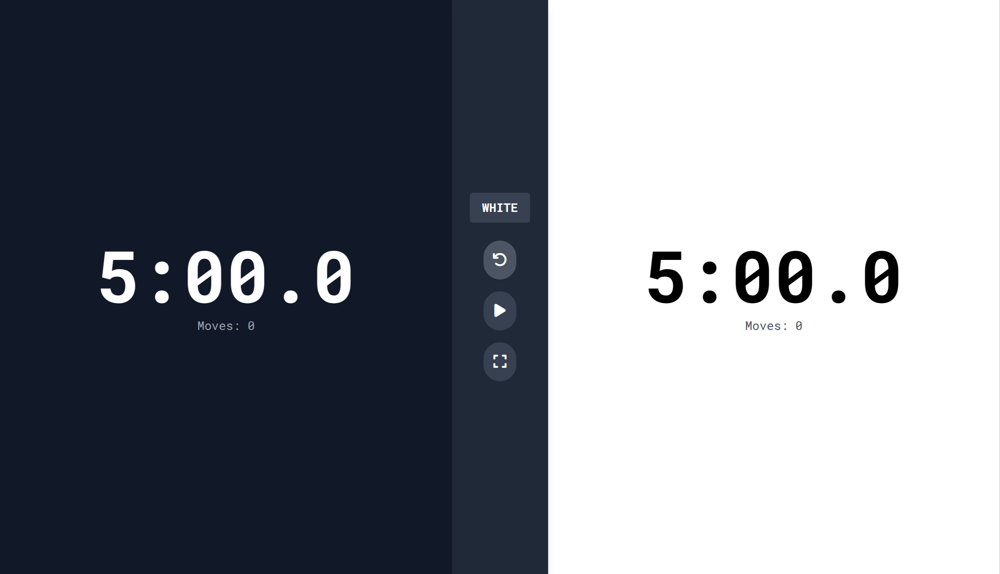
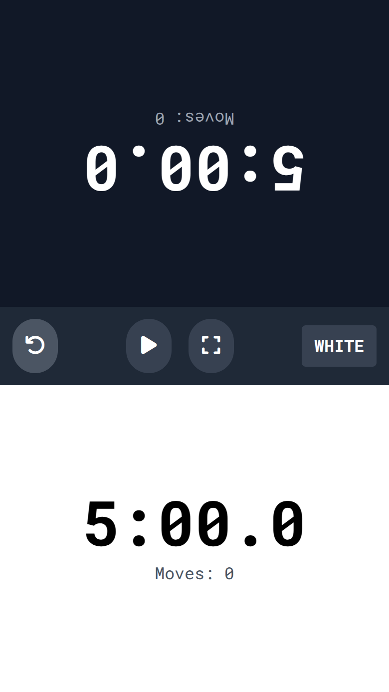

# ⏱️ Chess Clock Timer


A customizable chess clock and timer application for tracking game time. Perfect for chess players of all levels who need a reliable, easy-to-use timer with flexible time control options.

## 📱 Preview

### Desktop View



### Mobile View



## ✨ Features

- **Multiple Time Control Modes**: Support for various chess time formats (classical, rapid, blitz, etc.)
- **Customizable Settings**: Adjust time, increment, and delay settings to your preference
- **Responsive Design**: Works seamlessly on desktops, tablets, and mobile devices
- **Simple Interface**: Easy-to-use controls designed for minimal distraction during gameplay
- **Visual & Audio Alerts**: Clear notifications when time is running low
- **Offline Functionality**: No internet connection required after initial load

## 🚀 Live Demo

Try it now: [Chess Clock Timer](https://vzsoares.github.io/chess-timer-clock/)

## 🎮 How to Use

1. **Configure Time Settings**:

    - Set initial time for both players
    - Choose increment or delay if desired
    - Select any additional options

2. **Start the Clock**:

    - Press the start button or spacebar
    - Tap your timer after making a move to switch to your opponent's time

3. **During Play**:
    - Pause/resume as needed
    - Reset the clock for a new game
    - Adjust settings at any time

### Desktop Controls

- **Space Bar**: Start/Pause the timer
- **Left Arrow Key**: Switch to left player's time
- **Right Arrow Key**: Switch to right player's time
- **R Key**: Reset the clock
- **Mouse Click**: Click on a player's side to switch to the other player's time

### Mobile Controls

- **Tap**: Tap on a player's timer area to switch to the other player's time
- **Control Buttons**: Use on-screen buttons for start, pause, and reset functions
- **Rotate Device**: Turn your device horizontally for optimal viewing experience
- **Settings Menu**: Access the gear icon to adjust time controls

## 🔧 Development

### Prerequisites

- Node.js (v14+)
- npm or yarn

### Setup

```bash
# 1. Clone the repository:
git clone https://github.com/vzsoares/chess-timer-clock.git
cd chess-clock-timer

# 2. Install dependencies:
yarn install

# 3. Run development server:
yarn dev

# 4. Build for production:
yarn build
```

## 🛠️ Tech Stack

- **TypeScript**: For type-safe code
- **Alpine.js**: Lightweight JavaScript framework for reactivity
- **TailwindCSS**: Utility-first CSS framework
- **Vite**: Next-generation frontend tooling

## 🤝 Contributing

Contributions are welcome! Feel free to:

- Report bugs and issues
- Suggest new features
- Submit pull requests
- Improve documentation

## 📄 License

This project is licensed under the MIT License - see the LICENSE file for details.

---

_Created by [vzsoares](https://github.com/vzsoares)_
